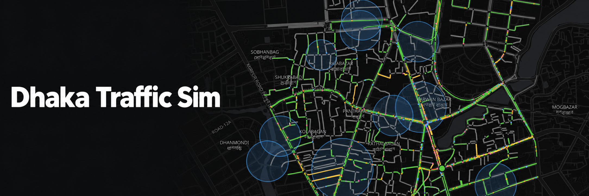

# Dhaka Traffic Sim

A web app for trying out traffic conditions on real Dhaka roads. Pick the whole city
or one of 15 neighbourhoods and a time of day, adjust how many vehicles enter and what
they are (cars, buses, CNGs, battery rickshaws, motorcycles, trucks, pedal rickshaws), and
watch congestion build up live on the map.

The simulation engine is [SUMO](https://eclipse.dev/sumo/) running on OpenStreetMap road
data. The browser only draws the map and controls; each browser tab gets its own SUMO
process on the server.

**Status: Phase 1 (view-only MVP).** Editing roads and comparing scenarios comes in
Phase 2.

## Run it

Requires [uv](https://docs.astral.sh/uv/) and Node 20+. SUMO installs from PyPI; there is
nothing to install system-wide.

One command does everything below: it installs dependencies, builds any missing areas
and runs the backend and frontend together. Ctrl+C stops both.

```sh
./dev.sh                  # http://localhost:5173
./dev.sh --prepare-all    # also rebuild every area's network (--download: re-fetch OSM)
./dev.sh --no-prepare     # skip area building
```

Or step by step:

```sh
# 1. Backend: install, build the road networks (~1 min per area), start the server
cd backend
uv sync
uv run traffic-sim-prepare --all      # whole city + 15 neighbourhoods (~15 min, mostly download)
uv run traffic-sim-server             # http://127.0.0.1:8000

# 2. Frontend (second terminal)
cd frontend
npm install
npm run dev                           # http://localhost:5173
```

For a single-server setup, run `npm run build` in `frontend/`. `traffic-sim-server`
then serves the built app at http://127.0.0.1:8000.

### Add another area

Presets live in `backend/src/traffic_sim/config.py`. Any bounding box in any city also
works (west,south,east,north). Keep it under about 3 × 3 km, or the simulation slows down:

```sh
uv run traffic-sim-prepare pallabi --name "Pallabi" --bbox 90.355,23.815,90.375,23.830
```

It appears in the Area dropdown after a page reload.

## Deploy with Docker

The image holds everything: the SUMO binaries, the backend, the built frontend and any
road networks already built in `backend/data/areas`.

```sh
docker compose up -d --build           # http://<server>:8000
PORT=80 TRAFFIC_SIM_MAX_SIMS=8 docker compose up -d
```

- **Road networks.** Areas missing from the image are built on first start. This
  downloads from OpenStreetMap and takes ~15 min for all of them on a fresh clone. They
  are kept in the `areas` volume. `PREPARE_AREAS=none` skips the build; `all` rebuilds
  every area.
- **Sizing.** Every open browser tab runs its own SUMO process, and SUMO is
  single-threaded. `TRAFFIC_SIM_MAX_SIMS` (default 4) caps how many run at once, so give
  the server about that many cores. Later tabs get "server busy".
- **Behind a reverse proxy** (nginx, Caddy, Traefik), forward WebSocket upgrades for
  `/ws/`. In nginx that means `proxy_http_version 1.1` plus the `Upgrade`/`Connection`
  headers. Caddy's `reverse_proxy` does it automatically.
- **Different CPU.** To build for a server with a different CPU than your machine, use
  `docker buildx build --platform linux/amd64 -t traffic-sim .`. SUMO ships wheels for
  amd64 and arm64.

## How it works

A plain-language guide for people using the simulator (what it models, how to read the
results, its limitations) is built into the app: open *How it works and how to use it*
in the side panel, or go to `/#docs`.

```
backend/src/traffic_sim/
  prepare.py   OSM download (Overpass) → netconvert → network.geojson for the map
  vtypes.py    Dhaka vehicle types: size, speed, gap-taking behaviour
  demand.py    Live trip generation: through traffic enters/exits at the area border,
               local trips start/end on streets weighted by lane-km
  engine.py    One SUMO run over TraCI: injects vehicles, steps, collects stats
  presets.py   Time-of-day scenarios (morning rush, Friday, night trucks…)
  scenario.py  Road edits: validates closures and signal plans, builds edited
               networks (U-turns, turn rules, added signals) with netconvert
  features.py  Bus stops, stands, crossings, hot zones, waterlogging, weather
  server.py    FastAPI: REST for areas/presets/road layouts, WebSocket streaming frames
frontend/src/
  lib/vehicleStore.ts   Interpolates between server frames so vehicles move at 60 fps
  components/MapView    MapLibre base map + deck.gl roads and to-scale vehicles
  components/Inspector  Road editor: closures, U-turns, signal timings
```

### Editing roads

Turn on **Edit roads on the map** in the side panel, then click a road, junction or
signal. There are two kinds of change:

- **Live**, applied to the running simulation over TraCI:
  - Closing a road, one direction of a two-way street, or single lanes (lane 1 is
    the kerb side). Vehicles heading for a closed road are rerouted. Vehicles
    with no other way to their destination queue at the closure, and the map
    tells you how many.
  - Traffic signal timings: *actuated* (a green stretches between a minimum and
    a maximum while traffic keeps arriving), *fixed time* (set durations), or
    *off* (drivers fall back to the junction's right of way). Which movements
    get green in each phase comes from the network.
- **Road features and weather**, also live, placed with the tools above the map:
  - Bus stops (buses stop in the kerb lane), rickshaw and CNG stands (vehicles
    parked at the kerb plus pickups), pedestrian crossing spots (people hold up
    every lane now and then), hot zones (more trips, kerbside stops, vendors,
    crowds) and waterlogging zones (ankle-, knee- or waist-deep).
  - Rain (slower, bigger gaps), flooding, random breakdowns, drivers
    re-planning around traffic (a restart option), and fewer trips starting when
    delays grow.
  - Timed closures (between two times of day) for events, VIP movements and
    accidents.

  The default waterlogging zones are 52 places reported flooded in 2024–26 news
  reports (`backend/src/traffic_sim/waterlogging.json`, with sources). Bus stops
  start from OpenStreetMap. See `features.py`.
- **Layout**, which needs a rebuilt network and restarts the simulation:
  - Mid-block U-turns. Dhaka's main roads are mapped as two one-way
    carriageways, so a U-turn opens a gap in the median between them. On an
    undivided street, vehicles turn around at the chosen point.
  - Allowing or banning U-turns at a junction.
  - Turn rules at a junction: *straight and left only* (no right turns or
    U-turns) or *left only*. A crossing of divided roads is mapped as several
    junctions a few metres apart; the rule merges them into one junction and
    covers the whole crossing.
  - Adding a traffic signal. It starts with an actuated plan that you can tune
    once the layout is applied.

  The server applies layout edits to the area's prepared network with netconvert
  (under a second for a neighbourhood), under `backend/data/variants/`. Edits are
  always relative to the unedited area, and identical edits reuse the same
  network. Closures and signal timings carry over to the new layout.

Choices that are specific to Dhaka:

- **Left-hand traffic** (`netconvert --lefthand`).
- **Lane-free movement.** SUMO's sublane model lets motorcycles, CNGs and rickshaws
  filter through gaps. It can be switched off in the UI to compare with lane-based
  traffic.
- **Battery rickshaws ("Tesla").** Since 2025 they outnumber pedal rickshaws (0.5–1.2
  million in Dhaka, depending on the source). They run at 20–30 km/h (up to 40) against
  10–12 km/h for a pedal rickshaw. Pedal rickshaws remain as a small share (~3%).
- **Rickshaws on main roads is a toggle, on by default.** Officially, battery and pedal
  rickshaws are banned from main roads (DNCC/DMP, April 2025; the minister said so again
  in August 2026). In practice they are everywhere. When the toggle is off they cannot
  use trunk or primary roads and detour through side streets. It works by switching the
  rickshaws' SUMO vClass (`moped` = allowed, `bicycle` = banned; see
  `backend/src/traffic_sim/dhaka.typ.xml`), so both rules share one network.
- **Whole city = main roads only.** The city network keeps motorway to tertiary roads
  (~1,500 km, 5,000 segments). Every residential lane in Dhaka would be ~100k segments,
  too many to simulate live. Neighbourhood areas include every street. Preset volumes
  are tuned on Farmgate and scaled to each area by its main-road lane-km.
- **Trucks** make up about 2% of daytime traffic and 19% in the night preset,
  matching the city's truck entry hours after 10 pm.

### Reading the numbers

The vehicle mix starts from the mid-2023 RSTP road survey (motorcycles 27%,
non-motorised 22%, cars 20%, three-wheelers 14%), shifted towards battery rickshaws for
2024–26 news reports. The volumes and driver behaviour are still **uncalibrated
guesses**, tuned only so the pattern looks right (free-ish midday, gridlock at rush hour). Use the
results to compare scenarios, e.g. "Evening rush is ~2× the delay of midday". Don't
treat them as forecasts. Calibrating against real vehicle counts is Phase 4.

- *Delay so far*: average time lost compared with free flow, for vehicles still on the
  road. This is the best gridlock indicator, because stuck vehicles never finish a trip
  and so never show up in *Trip time*.
- *Removed as stuck*: SUMO takes a vehicle off the road after it has been stuck for the
  configured time. Set this to "never" to see a true gridlock.
- The first 5 simulated minutes run at maximum speed to fill the empty roads.

## Tests

```sh
cd backend && uv run pytest     # runs real SUMO simulations over the WebSocket
cd frontend && npx tsc -b && npm run lint
```
